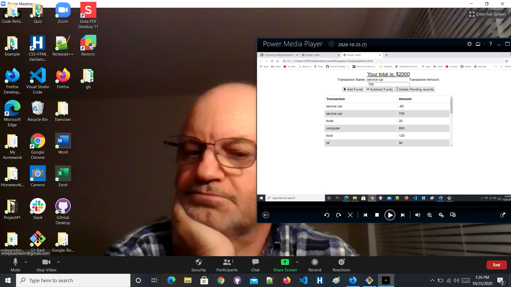
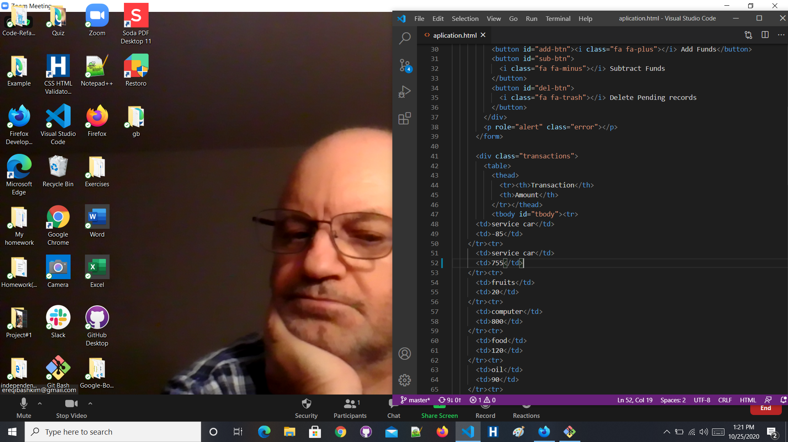

# Progressive-Budget

The Progressive Budget allows us to track the budget and have any data we enter be saved between uses. We can add deposits and withdrawls and this application will update our total funds accordingly.

